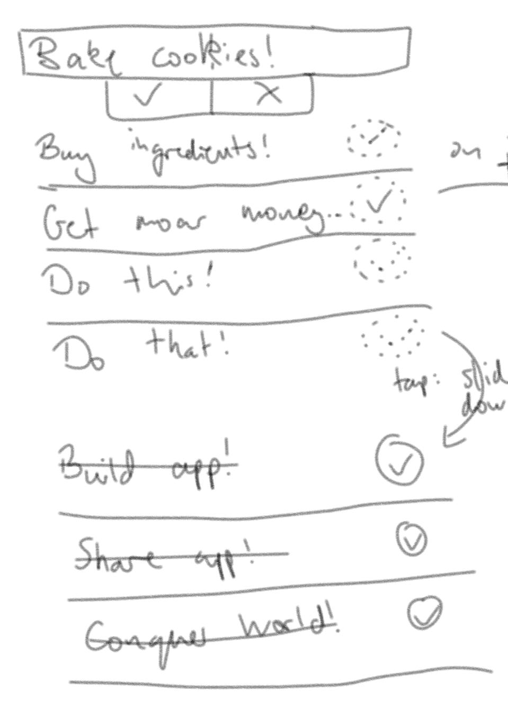
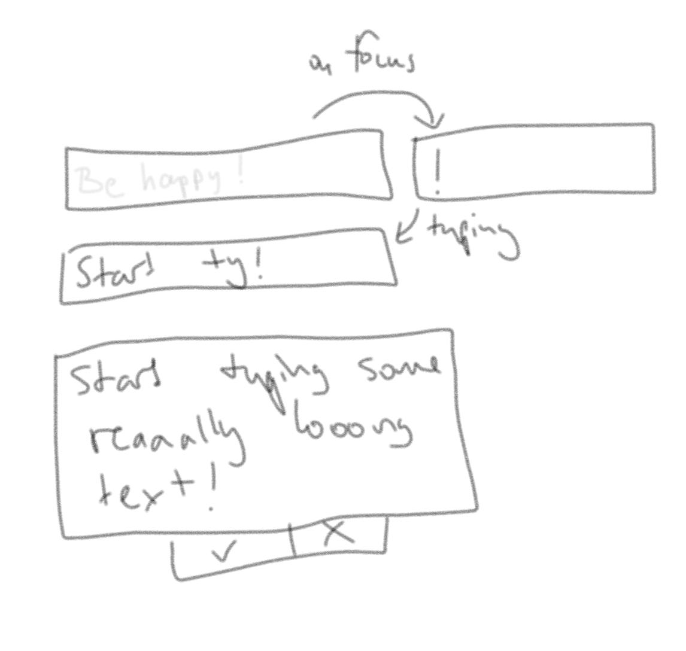
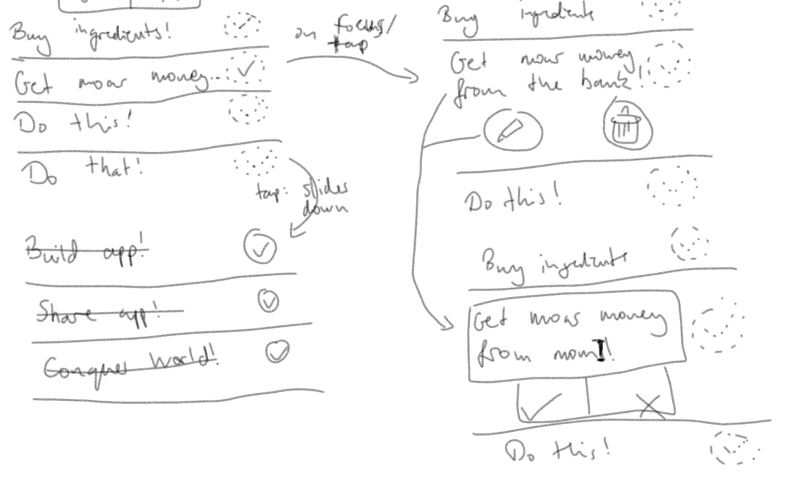

# Layout

At the top is the input for new tasks. Below is the list of todos. At the bottom is a list of tasks that are already done.

# Input
The input is a simple text field with an accompanying button. Using the button or `Enter` on the keyboard, the new task will be added to the todo list.

The input shows a placeholder with a cheeky sample task. The placholder updates every few seconds to a new funny task. The placeholder should prioritize subtlety over readability as to not be confused with an already filled out text field.

When focused, the exclamation point at the end of the sample task moves to the front and becomes styled like normally input text. The exclamation point is not selectable. Any text will be input in front of it.

If the task action overflows, the text input breaks into multiple lines.

# Editing

A task can be edited by tapping or focusing it. It opens up to show all of the possibly overflown action.

A toolbar is shown below the action message. It provides the following actions:

- Edit
- Remove

Editing transforms the action text into a text input that can be edited. It has the same restrictions regarding the exclamation point as the New Task Input.

Deleting removes the task without prompt. It will be placed in a trash list, so it is easily recoverable. A small pop-up shows up for a few seconds allowing immediate recovery of the deleted task.

# Marking as Done
A task can be marked as done by tapping the checkmark on its side or focusing it an pressing `Enter`.

Accomplished tasks move down into the done list. The action can be reverted with `Ctrl+Z` but does _not_ trigger a pop-up.

Tapping on an accomplished task's checkmark moves it back to the current task list. The action can be triggered with `Enter` when the task is focused. This is revertible as well with `Ctrl+Z`.
